# Presto.it

**Presto.it** è un marketplace online per la compravendita di articoli usati tra privati, ispirato a piattaforme come Subito.it e Vinted. Gli utenti possono pubblicare annunci con foto e descrizione, sfogliare gli articoli per categoria o tramite ricerca, gestire i propri annunci (modifica/eliminazione) e navigare il sito in più lingue.

## 👥 Team

Progetto sviluppato in team di 3 persone durante un percorso formativo (Hackademy):

- **Giuseppe Berardi**
- **Matteo Amoroso**
- **Cristina Fioroni**

## 🛠️ Stack tecnico

- **Backend:** Laravel (PHP)
- **Frontend:** Blade components, Bootstrap (con Sass)
- **Interattività:** Livewire (es. form di creazione articoli con validazione live)
- **Autenticazione:** Laravel Fortify
- **Gestione immagini:** Spatie Image, con resize asincrono tramite Laravel Queues
- **Multilingua:** sistema i18n con middleware dedicato per lo switch di lingua

## ✨ Funzionalità principali

- Registrazione e login utenti
- Pubblicazione, modifica ed eliminazione annunci
- Navigazione per categoria e ricerca articoli
- Homepage con annunci in evidenza/più recenti
- Interfaccia multilingua (IT/EN/ES)
- Resize automatico delle immagini in coda, per non rallentare l'inserimento annunci

# Componenti Blade

Piccola guida ai componenti del progetto, così da poter gestire la grafica in maniera unificata.

Dopo aver pullato fare npm install. Bootstrap ora ha il saas.

---

# Layout

## `x-layouts.app`

Layout di base del sito, con navbar e footer integrati. `{{ $slot }}` nel body (ovviamente).

`resources/views/components/layouts/app.blade.php`

**Props / input:**

- `title` — opzionale, default = nome dell'app
- slot — contenuto della pagina

**Uso:**

```blade
<x-layouts.app title="Accedi">
    ...
</x-layouts.app>
```

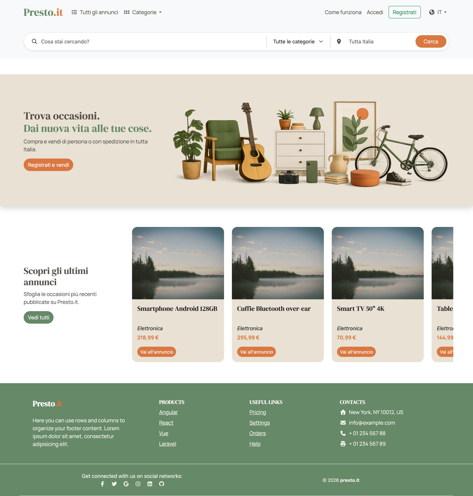

---

# Globali

## `x-navbar`

Navbar sticky top con diverse variazioni per desktop/mobile, generalmente gestite con `display: none` sui breakpoint.

`resources/views/components/navbar.blade.php`

**Props / input:**

- `showSearch` — flag interno per agganciarci la searchbar

**Uso:**

```blade
<x-navbar/>
```

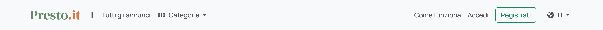

---

## `x-footer`

Footer template preso da MDN e poi personalizzato leggermente. _(da rivedere)_

`resources/views/components/footer.blade.php`

**Props / input:**

- nessuna

**Uso:**

```blade
<x-footer/>
```

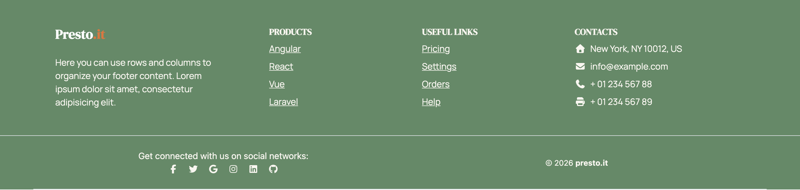

---

## `x-alerts`

Alerts per i messaggi di success, error e message. Rispettivamente verde, rosso, blu.

`resources/views/components/success.blade.php`

**Props / input:**

- nessuna

**Uso:**

```blade
<x-alerts/>
```

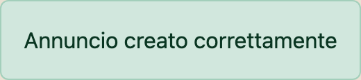

---

# Navbar (parti interne)

## `x-navbar.menu-browse`

Porzione sinistra della navbar. Contiene la principale navigazione degli annunci, senza filtri o per categoria.

`resources/views/components/navbar/menu-browse.blade.php`

**Props / input:**

- nessuna

**Uso:**

```blade
<x-navbar.menu-browse/>
```

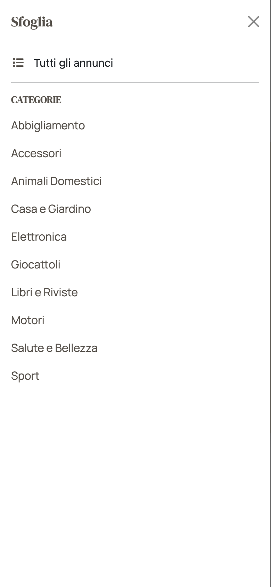

---

## `x-navbar.menu-auth`

Porzione destra della navbar. In desktop è un dropdown con icona `fa-user`, su mobile diventa un offcanvas da destra.
Include le principali interazioni di un utente loggato.

`resources/views/components/navbar/menu-auth.blade.php`

**Props / input:**

- nessuna

**Uso:**

```blade
<x-navbar.menu-auth/>
```

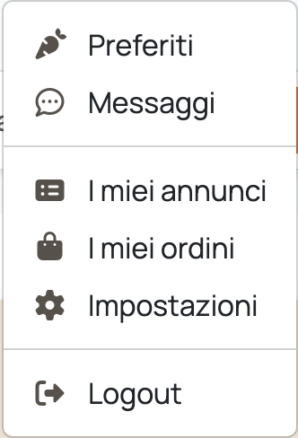

---

## `x-navbar.menu-guest`

Porzione destra della navbar. Simile per stile al `menu-auth`, invita l'utente ad accedere o registrarsi, con azioni
secondarie come cambiare lingua.

`resources/views/components/navbar/menu-guest.blade.php`

**Props / input:**

- nessuna

**Uso:**

```blade
<x-navbar.menu-guest/>
```

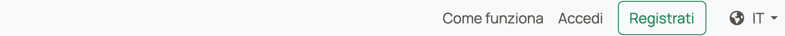

---

## `x-navbar.search-bar`

Barra di ricerca con campi _(ancora non funzionante)_. I campi sono il termine di query, un dropdown per le categorie (
vedi [`x-navbar.category-options`](#x-navbarcategory-options)) e la città dell'annuncio.

`resources/views/components/navbar/search-bar.blade.php`

**Props / input:**

- `show` — default `false`; renderizza la barra solo se `true`
- richiede `$categories` (passato al dropdown categorie)

**Uso:**

```blade
<x-navbar.search-bar :show="$showSearch"/>
```

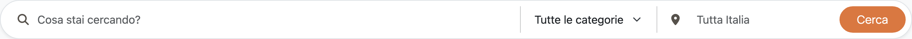

---

## `x-navbar.category-options`

Lista delle `<option>` condivise della searchbar in modalità desktop e mobile.

`resources/views/components/navbar/category-options.blade.php`

**Props / input:**

- `categories` *(obbligatorio)* — collezione delle categorie

**Uso:**

```blade
<select name="category" class="form-select ...">
    <x-navbar.category-options :categories="$categories"/>
</select>
```

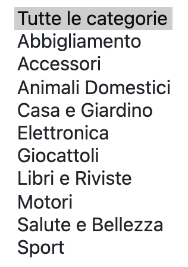

---

# Homepage

## `x-home.hero`

La hero della homepage. Contiene una piccola call to action ed un carosello.

`resources/views/components/home/hero.blade.php`

**Props / input:**

- nessuna

**Uso:**

```blade
<x-home.hero/>
```

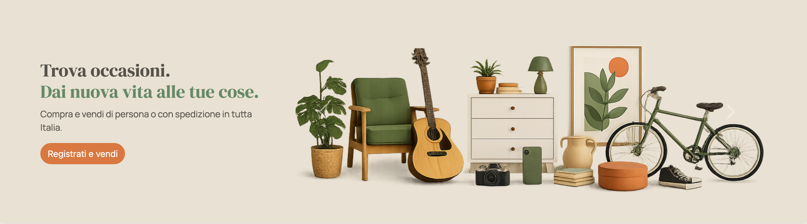

---

## `x-home.latest-articles`

Secondo modulo della homepage. Mostra gli ultimi articoli caricati. Appena possibile sarà sostituito da un altro modulo
che consiglia gli articoli all'utente in base alle sue ricerche passate, suddivise per generi.

`resources/views/components/home/latest-articles.blade.php`

**Props / input:**

- `articles` — collezione degli articoli da mostrare

**Uso:**

```blade
<x-home.latest-articles :articles="$articles"/>
```

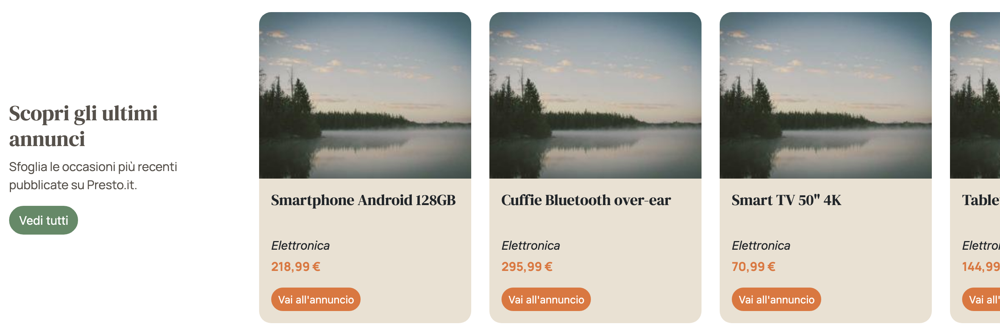

---

# Annunci (card & form)

## `x-article-card`

La card di preview degli articoli standard.

`resources/views/components/article-card.blade.php`

**Props / input:**

- `article` *(obbligatorio)* — il modello `Article`
- `fluid` — default `false`; a `true` la card è a larghezza piena (altrimenti fissa 280px)

**Uso:**

```blade
<x-article-card :article="$article" fluid/>
```


---

## `x-my-article-card`

Card preview annuncio specifica per la gestione dell'utente. Rispetto alla card preview normale ha un bottone Modifica
ed uno Elimina.

`resources/views/components/my-article-card.blade.php`

**Props / input:**

- `article` *(obbligatorio)* — il modello `Article` da mostrare

**Uso:**

```blade
<x-my-article-card :article="$article"/>
```

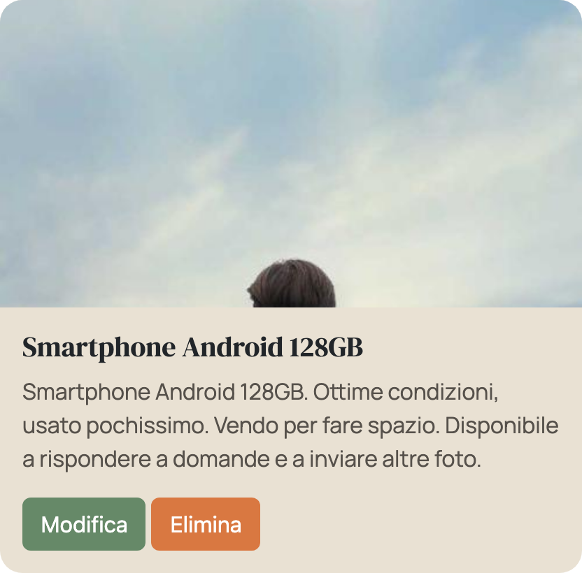

---

## `<livewire:article-create>`

Form di creazione articoli fatto con Livewire in single component. La validazione viene quindi gestita direttamente
dentro la vista con `#[Validate]`.

`resources/views/components/⚡article-create.blade.php`

**Props / input:**

- nessuna (componente Livewire; usa `x-input-error` e `x-success`)

**Uso:**

```blade
<livewire:article-create/>
```

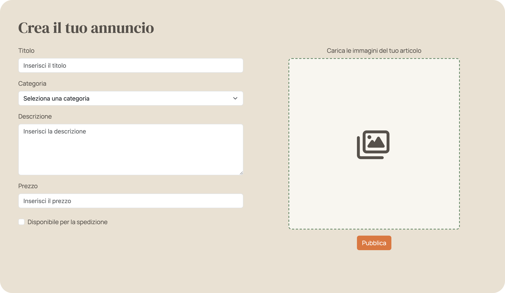

---

# Form & stati (helper UI)

## `x-form-field`

Form input con validazione integrata nello stile del sito.

`resources/views/components/form-field.blade.php`

**Props / input:**

- `name` *(obbligatorio)* — nome del campo; usato per `name`, `id` e per recuperare l'errore
- `label` *(obbligatorio)* — testo dell'etichetta
- `type` — tipo di input, default `text` (es. `email`, `password`)
- `show-error` — default `true`; a `false` nasconde l'errore inline
- attributi extra (es. `wire:model`, `placeholder`) → inoltrati all'`<input>`

**Uso:**

```blade
<x-form-field name="email" label="Email" type="email"/>
```

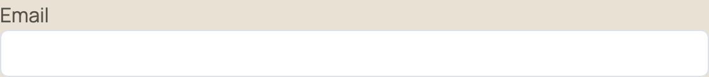

---

## `x-input-error`

Mini componente che mostra il testo degli errori di validazione dentro di un campo.

`resources/views/components/input-error.blade.php`

**Props / input:**

- `field` *(obbligatorio)* — nome del campo di cui mostrare l'errore

**Uso:**

```blade
<x-input-error field="title"/>
```

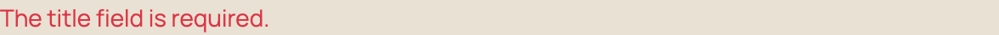

---

## `x-empty-state`

Card per gli stati vuoti, quando un array non ha contenuti. I messaggi "Oops, sembra che non ci siano risultati". _(da
rivedere il design)_

`resources/views/components/empty-state.blade.php`

**Props / input:**

- `fixed` — default `false`; a `true` usa la variante a larghezza fissa (280px) per il carosello in homepage
- slot — testo del messaggio

**Uso:**

```blade
<x-empty-state>Non hai ancora pubblicato nessun annuncio.</x-empty-state>

{{-- variante a larghezza fissa per il carosello in homepage --}}
<x-empty-state fixed>Sembra non ci siano ancora annunci...</x-empty-state>
```

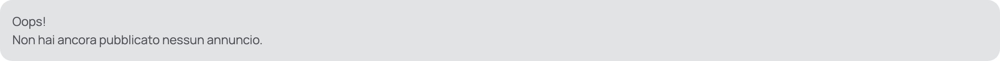
